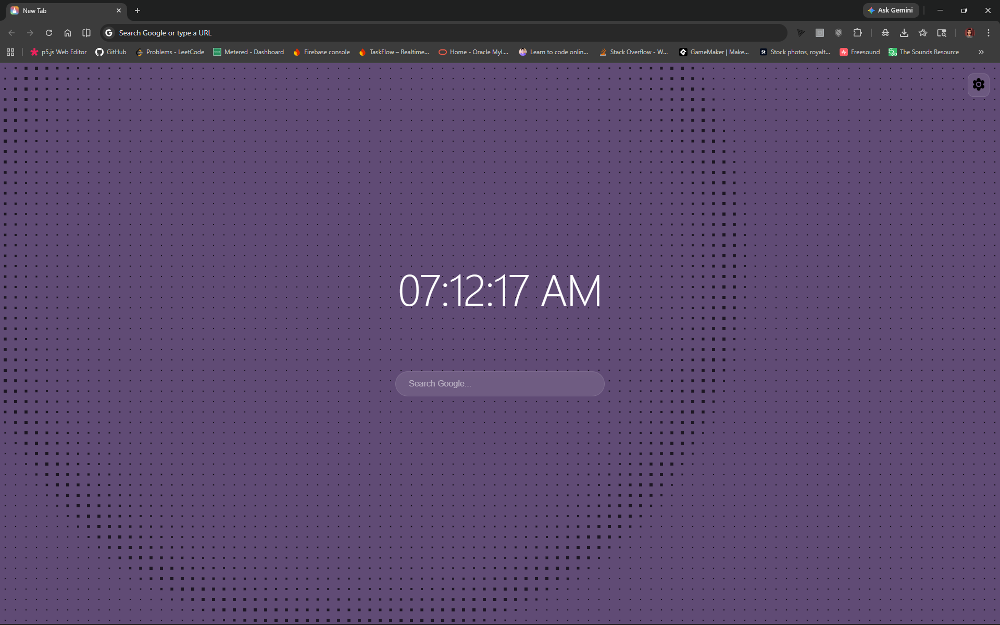
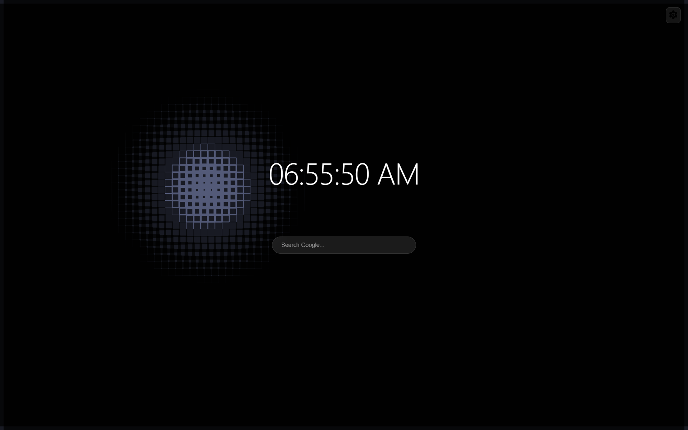
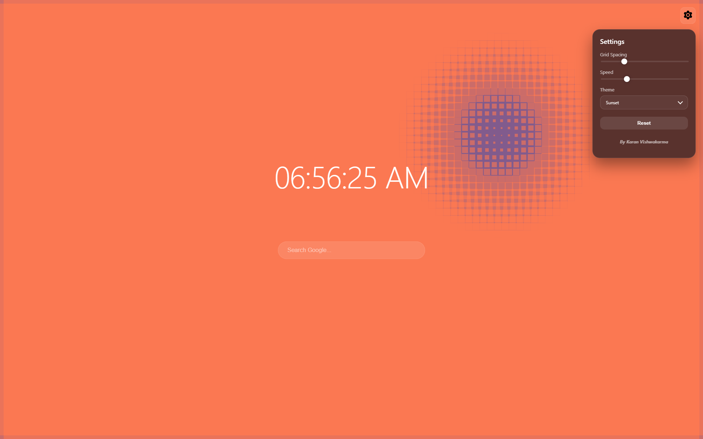
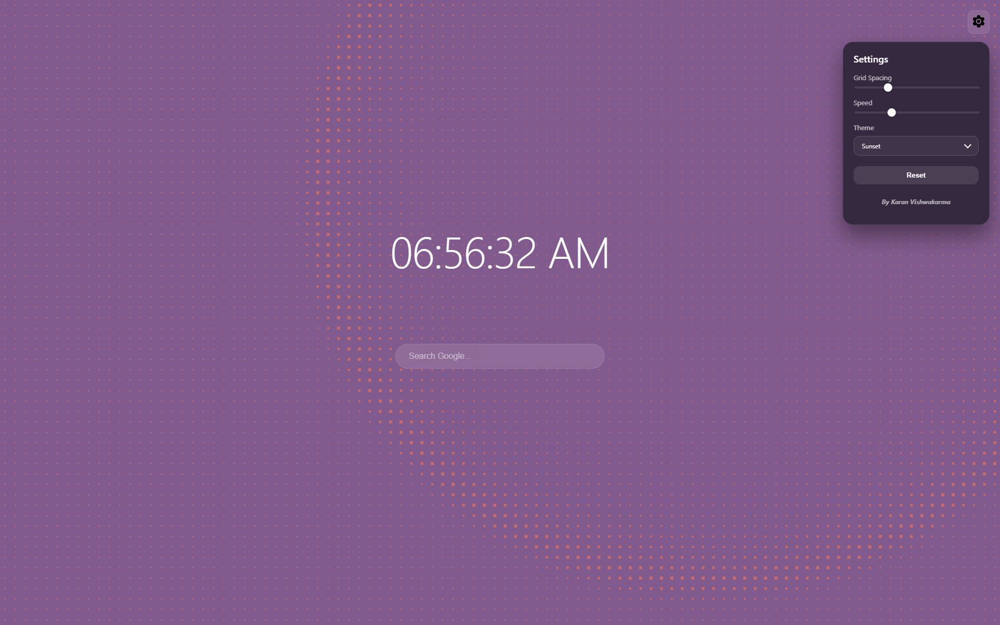

# Interactive Grid Chrome Extension

A visually dynamic Chrome New Tab extension built using **p5.js**, featuring an interactive grid, ripple effects, and customizable UI.

---

## Features

* Mouse-reactive grid system
* Cinematic ripple effect on click
* Screen flash feedback
* Dynamic background colors
* Minimal clock UI
* Search bar (Google integration)
* Settings panel (spacing, speed, themes)
* Persistent settings using localStorage

---

## Screenshots

> Add your screenshots here






---

## Demo GIF

> Add a demo GIF here


---

## Installation (Manual)

1. Clone or download this repository
2. Open Chrome and go to:

   ```
   chrome://extensions/
   ```
3. Enable **Developer Mode**
4. Click **Load unpacked**
5. Select the project folder

---

## How It Works

* The grid is rendered using **p5.js**
* Mouse movement affects grid scale dynamically
* Clicking triggers a **single expanding ripple wave**
* Ripple temporarily overrides mouse interaction
* UI controls update behavior via **localStorage**

---

## Customization

Open settings panel (Gear icon):

* **Grid Spacing** → density of grid
* **Speed** → animation smoothness
* **Theme** → visual color styles

---

## Project Structure

```
grid-extension/
├── index.html
├── style.css
├── sketch.js
├── ui.js
├── p5.min.js
├── README.md
```

---

## Future Ideas

* Multi-ripple system
* Audio-reactive mode
* Particle overlays
* Theme presets
* Clock/weather widgets

---

## Author

Built by Karan Vishwakarma\nas a creative coding + UI experiment using p5.js.

---

## License

Free to use and modify.
