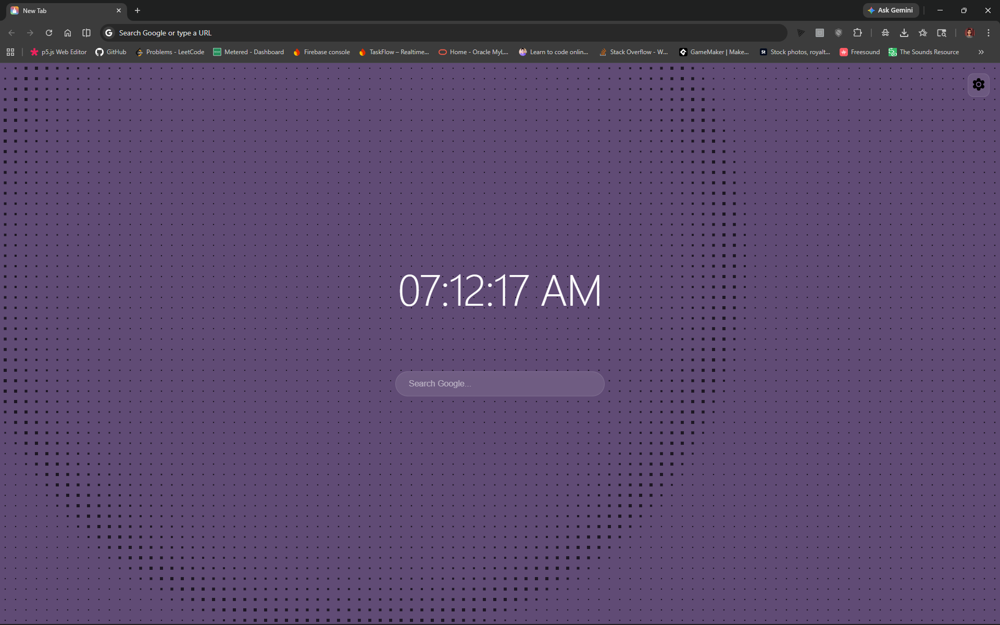
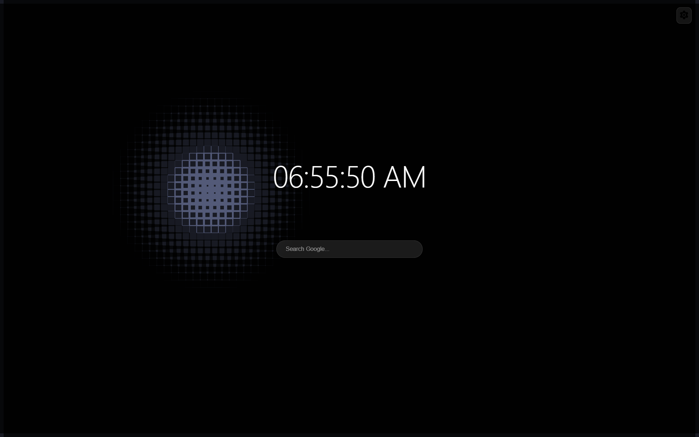
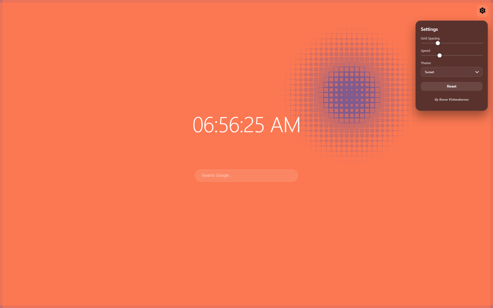

# Interactive Grid Chrome Extension

A creative Chrome New Tab extension built with HTML, CSS, JavaScript, and p5.js. It replaces the default new tab page with animated generative themes, a clock, Google search, theme previews, settings, and a fullscreen toggle.

---

## Features

- Animated p5.js themes
- Theme picker with preview images
- One-click theme apply flow
- Persistent saved theme and settings using `localStorage`
- Frosted-glass clock and search bar
- Google search integration
- Settings panel for grid spacing and animation speed
- Fullscreen toggle with animated icon feedback
- Modular `themes/` folder for adding new p5.js themes

---

## Included Themes

- Ocean
- Bouncing Ball
- Moving Dial
- Rotating Blocks
- Rotating Pacman
- Tenticle
- Collision Grid

---

## Screenshots





---

## Demo

<p align="center">
  
</p>

---

## Installation

1. Clone or download this repository.
2. Open Chrome and go to:

   ```text
   chrome://extensions/
   ```

3. Enable Developer Mode.
4. Click Load unpacked.
5. Select this project folder.
6. Open a new tab.

---

## Usage

- Click the theme button in the top-left corner to open the theme menu.
- Select a theme card, then click Apply.
- Click the settings button in the top-right corner to adjust spacing and speed.
- Click Save to keep the current theme and settings for future new tabs.
- Click Reset to return to the default Ocean theme and default settings.
- Click the fullscreen button in the bottom-left corner to toggle fullscreen mode.

---

## How It Works

`p5.min.js` provides the p5.js drawing library.

`sketch.js` acts as the shared theme runner. It owns the p5 lifecycle functions such as `setup()`, `draw()`, `windowResized()`, and `mousePressed()`, then forwards those calls to the currently active theme.

Each file inside `themes/` registers a theme through `window.registerTheme(...)`. The UI reads the registered themes and builds the theme picker automatically from them.

---

## Project Structure

```text
Interactive Grid Chrome Extension/
|-- assets/
|   |-- screenshots/
|   |-- theme_preview/
|   |-- favicon.png
|   |-- fullscreen_logo.svg
|   |-- gear_logo.svg
|   `-- theme_logo.svg
|-- themes/
|   |-- themeRegistry.js
|   |-- interactiveGrid.js
|   |-- collisionGrid.js
|   |-- bouncingBall.js
|   |-- movingDial.js
|   |-- rotatingBlocks.js
|   |-- rotatingPacman.js
|   `-- tenticle.js
|-- index.html
|-- style.css
|-- sketch.js
|-- ui.js
|-- p5.min.js
|-- manifest.json
|-- README.md
`-- LICENSE
```

---

## Adding A New Theme

1. Create a new file inside `themes/`.

   ```text
   themes/Theme.js
   ```

2. Register the theme using this format:

   ```js
   window.registerTheme({
     id: "Theme",
     name: "Theme",
     previewImage: "assets/theme_preview/theme.png",
     create: function createTheme() {
       return {
         setup(p, settings) {
           // Runs when the theme starts
         },

         draw(p, settings) {
           // Runs every frame
           p.background(0);
         },

         windowResized(p, settings) {
           // Optional
         },

         mousePressed(p, settings) {
           // Optional
         }
       };
     }
   });
   ```

3. Add a preview image inside:

   ```text
   assets/theme_preview/theme.png
   ```

4. Load your theme in `index.html` before `sketch.js`:

   ```html
   <script src="themes/Theme.js"></script>
   ```

5. Refresh the extension. Your theme should appear in the theme picker.

Important: do not define global `setup()` or `draw()` functions in theme files. Use `setup(p, settings)` and `draw(p, settings)` inside `window.registerTheme(...)` instead.

---

## Author

[Built by Karan Vishwakarma as a creative coding and UI experiment using p5.js.](https://www.pattvira.com/)

---
## Credits

- [Patt Vira - Learning and Theme Inspirations](https://www.pattvira.com/)
- [Colophon Foundry - "Ndot 55" font file ](https://www.onlinewebfonts.com/download/5f21b8d13dad527377311ec2d5388bdf)</br>
All credits for them and the resources they have provided.</br>
It helped a lot in this project.

---

## License

Free to use and modify.
